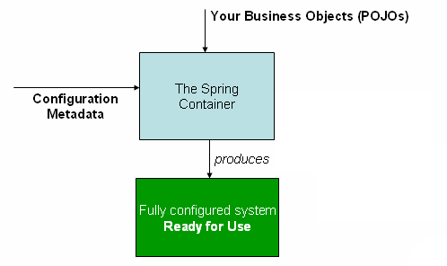

## 1. The IoC container

### 1.2. Container overview（容器概述）

The interface `org.springframework.context.ApplicationContext` represents the Spring IoC container and is responsible for instantiating, configuring, and assembling the aforementioned beans. The container gets its instructions on what objects to instantiate, configure, and assemble by reading configuration metadata. The configuration metadata is represented in XML, Java annotations, or Java code. It allows you to express the objects that compose your application and the rich interdependencies between such objects.

接口org.springframework.context.ApplicationContext表示Spring IoC容器，并负责实例化、配置和组装上述bean。容器通过读取配置元数据获得关于实例化、配置和组装对象的指令。配置元数据用XML、Java注释或Java代码表示。它允许您表达组成应用程序的对象以及这些对象之间的丰富相互依赖关系。

Several implementations of the `ApplicationContext` interface are supplied out-of-the-box with Spring. In standalone applications it is common to create an instance of `ClassPathXmlApplicationContext` or `FileSystemXmlApplicationContext`. While XML has been the traditional format for defining configuration metadata you can instruct the container to use Java annotations or code as the metadata format by providing a small amount of XML configuration to declaratively enable support for these additional metadata formats.

随Spring一起提供了ApplicationContext接口的几种实现。在独立应用程序中，创建ClassPathXmlApplicationContext或FileSystemXmlApplicationContext实例是很常见的。虽然XML一直是定义配置元数据的传统格式，但您可以指示容器使用Java注释或代码作为元数据格式，通过提供少量的XML配置来声明支持这些额外的元数据格式。

In most application scenarios, explicit user code is not required to instantiate one or more instances of a Spring IoC container. For example, in a web application scenario, a simple eight (or so) lines of boilerplate web descriptor XML in the `web.xml` file of the application will typically suffice (see Convenient ApplicationContext instantiation for web applications). If you are using the Spring Tool Suite Eclipse-powered development environment this boilerplate configuration can be easily created with few mouse clicks or keystrokes.

在大多数应用程序场景中，不需要显式用户代码来实例化Spring IoC容器的一个或多个实例。例如，在web应用程序场景中，应用程序的web.xml文件中的8行（大约8行）样板web描述符XML通常就足够了（请参阅Convenient ApplicationContext instantiation for web applications）。如果您使用的是基于eclipse的Spring Tool Suite开发环境，那么只需单击鼠标或敲击键盘就可以轻松地创建这个样板配置。

The following diagram is a high-level view of how Spring works. Your application classes are combined with configuration metadata so that after the ApplicationContext is created and initialized, you have a fully configured and executable system or application.

下面的图是Spring工作原理的高级视图（Figure 1. The Spring IoC container）。您的应用程序类与配置元数据相结合，这样在创建和初始化ApplicationContext之后，您就有了一个完整配置的可执行系统或应用程序。

